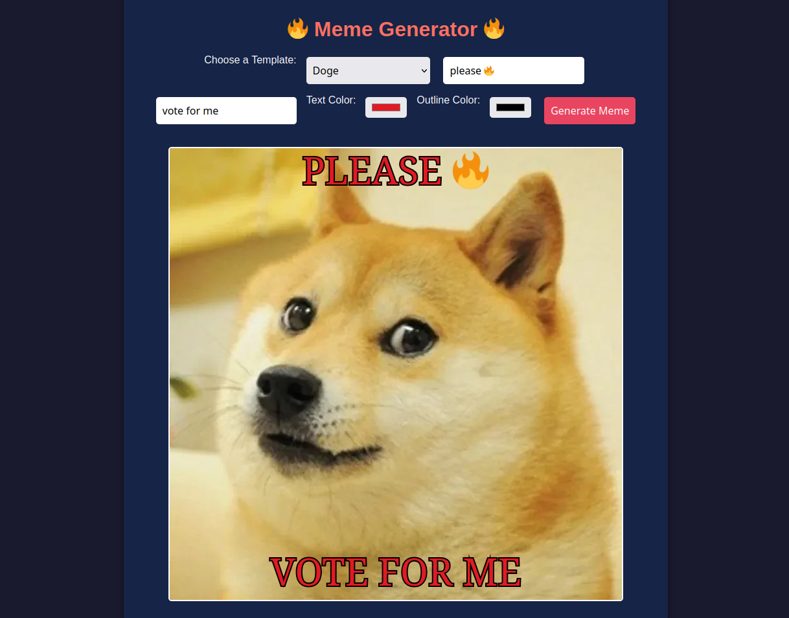

# 🔥 Meme Generator 🔥

Create and customize hilarious memes directly in your browser with this easy-to-use meme generator. Choose from popular templates, upload your own images, and personalize them with text, colors, and more! 🎨



---

## 🚀 Features

- **Preloaded Templates**: Includes classics like Drake, Distracted Boyfriend, and Doge! 🐕
- **Custom Image Upload**: Use your own images to create unique memes. 📸
- **Text Customization**: Add top and bottom text with customizable colors and outlines. ✏️
- **Real-Time Preview**: See your meme as you create it. 👀
- **Download Your Meme**: Save your creations as `.png` files. 💾

---

## 📂 File Structure

```
/project-folder/
│
├── index.html       # Main HTML file
├── styles.css       # Styling for the app
├── script.js        # JavaScript logic
├── drake.png        # Preloaded meme template
├── boyfriend.png    # Preloaded meme template
└── doge.png         # Preloaded meme template
```

---

## 🛠️ How to Use

1. **Clone or Download** this repository:
   ```bash
   git clone https://github.com/mzums/meme_generator
   ```
2. **Open** the `index.html` file in your favorite browser.
3. **Start Creating Memes**:
   - Select a template from the dropdown.
   - Customize text, colors, and outlines.
   - Upload your own image for a personal touch. 🎉
4. **Download** your masterpiece by clicking the download button.

---

## 🌟 Templates

Here are the preloaded templates you can use:
- **Drake** 🧢: Classic "Hotline Bling" decision-making meme.
- **Distracted Boyfriend** 💑: A hilarious choice-focused template.
- **Doge** 🐶: Wow. Much meme. So fun.

Feel free to add your own templates by placing image files in the project folder and updating the `templates` object in `script.js`.

---

## 🎨 Future Improvements

- Add drag-and-drop functionality for image uploads. 🖼️
- Include more meme templates by default. 🤩
- Support for resizing and moving text dynamically on the canvas. 📐
- Mobile-friendly design for meme-making on the go. 📱

---

## 📜 License

This project is open-source and available under the [MIT License](LICENSE). Feel free to use, modify, and share! ❤️

---

Enjoy creating memes! 🚀✨